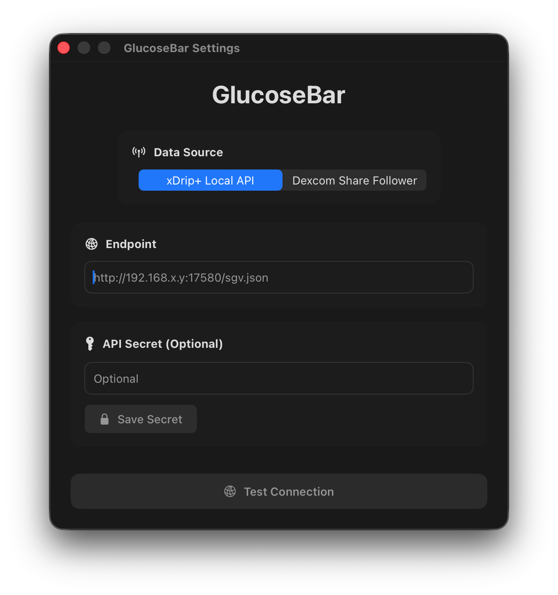
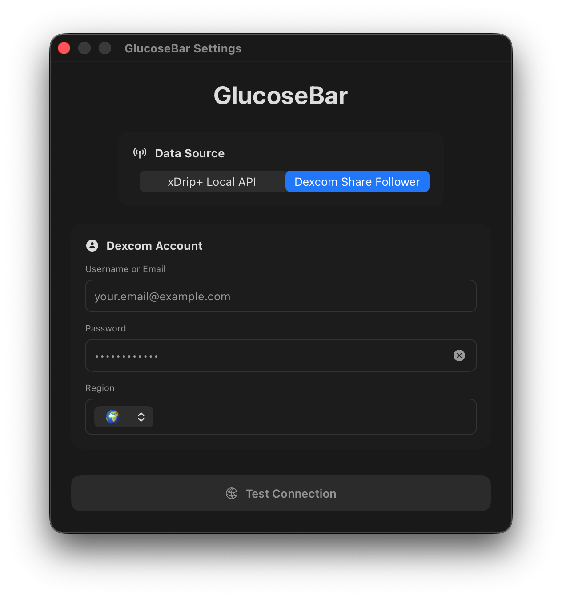

# GlucoseBar

<p align="center">
  
</p>

<p align="center">
  <strong>Continuous Glucose Monitoring in your macOS Menu Bar</strong>
</p>

<p align="center">
  A lightweight, native macOS menu bar app for monitoring glucose levels.
</p>

---

## 📸 Screenshots

### Menu Bar


### Settings - xDrip+ Mode


### Settings - Dexcom Share Mode


## 🚀 Getting Started

### Requirements

- macOS 12.0 or later
- One of the following:
  - **xDrip+** running on your phone (same WiFi network)
  - **Dexcom** account 

### Installation

#### Option 1: Download Release (Recommended)
1. Download the `.dmg` file from [Releases](link-to-releases).
2. Open the `.dmg` file and drag `GlucoseBar.app` to your Applications folder.
3. Right-click the app and select **Open** to bypass macOS security warnings (or run `xattr -c /Applications/GlucoseBar.app` in Terminal).
   > **Note:** macOS blocks apps from unidentified developers by default to protect your computer. Since GlucoseBar is not notarized by Apple (which requires a paid developer account), you’ll need to manually approve it the first time you open it.
4. Open GlucoseBar.
5. Configure your data source in Settings.

#### Option 2: Build from Source
```bash
git clone https://codeberg.org/heyimnel/GlucoseBar.git
cd glucosebar
open GlucoseBar.xcodeproj
```
Build in Xcode (`⌘B`) or build and run (`⌘R`).
*Note: Requires Xcode.*

## ⚙️ Configuration

### Using xDrip+ Local API
**Perfect for when you're at home on the same WiFi network:**

#### **Steps:**
1. **Enable xDrip+ Web Service:**
   - Open **Settings** in xDrip+.
   - Select **"Inter-app Settings"**.
   - Scroll down and enable these *BOTH*:
     - *xDrip Web Service*
     - *Open Web Service*

2. **(Optional) Find Your Phone's IP Address:**
   - **Android:**
     - Go to **Settings** > **Network & Internet** (or similar) > **Internet**.
     - Select your Wi-Fi network and scroll down to find **"IP address"**.
   - **iOS:**
     - Open the **Settings** app.
     - Tap **Wi-Fi**.
     - Find your connected Wi-Fi network and tap the **(i)** icon next to it.
     - Scroll down to the **IPV4 ADDRESS** section to find your IP address.

3. **Configure GlucoseBar:**
   - Open **GlucoseBar** on your Mac.
   - Enter the following URL (replace `YourIP` with your phone's actual IP address):
     ```
     http://YourIP:17580/sgv.json
     ```
   - Click **"Test Connection"**.

#### **Requirements:**
- xDrip+ running on your phone.
- Your phone and Mac must be on the **same Wi-Fi network**.
- **xDrip Web Service** and **Open Web Service** must be enabled in xDrip+ settings.

### Using Dexcom Share

1. Open Settings (click the menu → Configure)
2. Select "Dexcom Share Follower"
3. Enter your Dexcom username/email
4. Enter your Dexcom password
5. Select your region (US, Outside US, or Japan)
6. Click "Save Password"
7. Click "Test Connection"

**Requirements:**
- Dexcom account
- Share enabled in Dexcom settings
- Internet connection

## 📊 Understanding the Display

### Menu Bar Indicators

| Display | Meaning |
|---------|---------|
| `↑ 150` | Glucose rising at 150 mg/dL |
| `→ 95` | Glucose stable at 95 mg/dL |
| `↓ 70` | Glucose falling at 70 mg/dL |
| `⏰ → 120` | Reading is stale (>15 min old) |
| `⚙️ --` | Not configured |
| `🔒 --` | Authentication failed |
| `⚠️ --` | Network error |

## 📝 License

This project is licensed under the MIT License - see the [LICENSE](LICENSE) file for details.

## ⚠️ Disclaimer

This app is intended for informational purposes only and should not be used as a substitute for professional medical advice, diagnosis, or treatment. Always consult with a qualified healthcare provider regarding diabetes management. Never make treatment decisions based solely on this app.

The developers assume no responsibility for any misuse of this application or any harm that may result from its use.

---

<p align="center">
  Made for the T1D community
</p>
